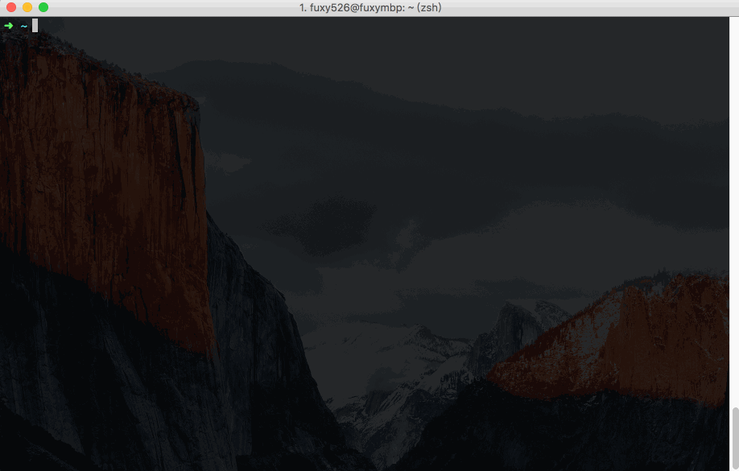

# Bing Dictionary CLI
<p>
	<a href="https://www.npmjs.com/package/bdic-cli"></a>
	<a href="https://www.npmjs.com/package/bdic-cli"></a>
	<a href="https://www.npmjs.com/package/bdic-cli"></a>
</p>

A simple command line tool of Bing Dictionary.

* English -> Chinese
* Chinese -> English
* Three modes: Brief Mode | Complete Mode | Browser Mode 





### Install

```sh
npm install -g bdic-cli
```

### Usage

```Sh
bdic <word>    #search a word in brief definition mode
bdic -c <word> #search a word in complete definition mode
bdic -b <word> #search a word in default browser
```

### Changelog

* v1.0.0  brief mode | complete mode | browser mode